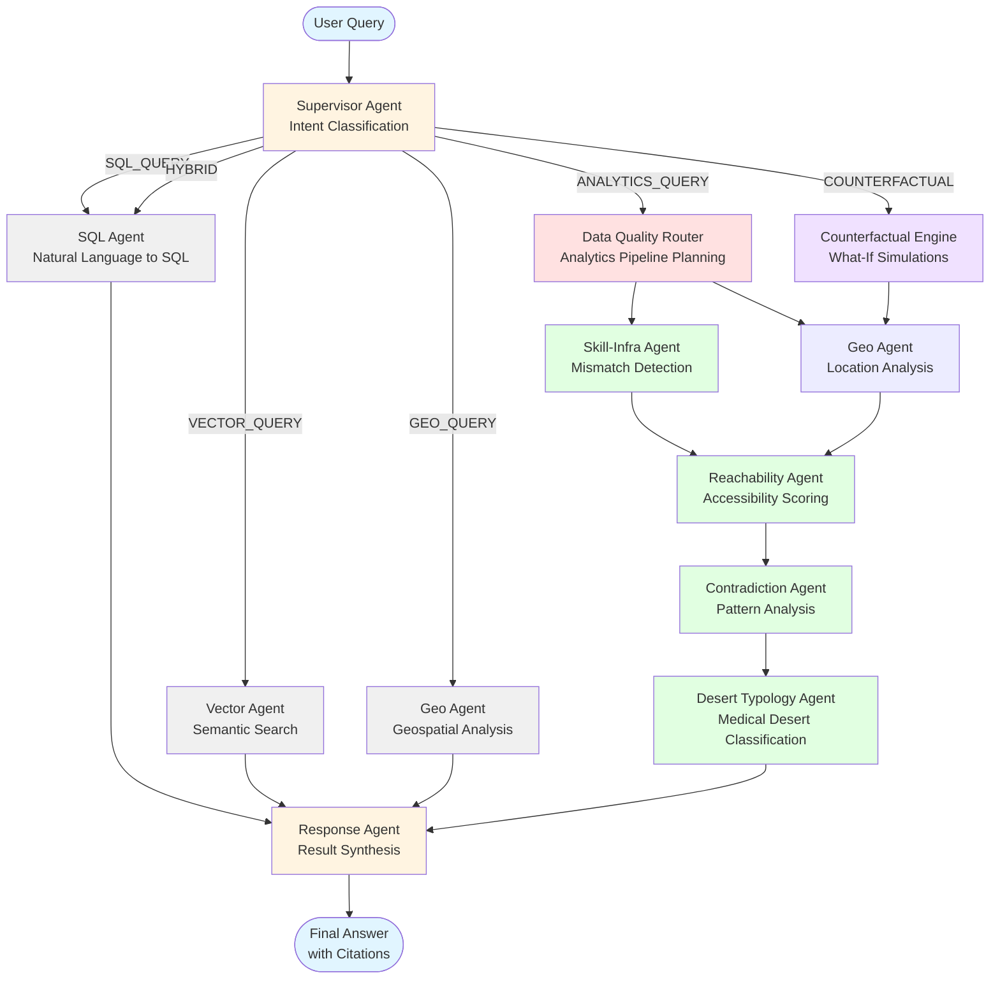

# US Healthcare Agent System - Architecture Graph

This document describes the multi-agent system architecture for analyzing US healthcare facility data.

## System Flow Diagram



## Agent Responsibilities

### Core Agents

**Supervisor Agent**
- Classifies user intent
- Routes to appropriate downstream agents
- Intent types: SQL, Vector, Geo, Analytics, Counterfactual, Hybrid

**SQL Agent**
- Converts natural language to SQL
- Queries US healthcare database
- Returns structured data results

**Vector Agent**
- Semantic search over facility descriptions
- Uses embeddings for similarity matching
- Finds contextually relevant facilities

**Geo Agent**
- Geographic distribution analysis
- Proximity analysis (within radius)
- Cold spot identification (underserved areas)

**Response Agent**
- Synthesizes results from all agents
- Generates natural language responses
- Adds citations and data sources

### Analytics Agents

**Data Quality Router**
- Plans analytics pipeline execution
- Determines which specialized agents to invoke
- Manages agent execution sequence

**Skill-Infrastructure Agent**
- Detects capability-equipment mismatches
- Validates medical claims
- Severity classification (critical/moderate/minor)

**Reachability Agent**
- Computes accessibility scores
- Combines geographic + capability factors
- Identifies low-access areas

**Contradiction Agent**
- Builds contradiction graph
- Identifies systemic vs isolated issues
- Clusters related problems

**Desert Typology Agent**
- Classifies medical deserts by type:
  - Geographic deserts (no facilities nearby)
  - Capability deserts (facilities lack services)
  - Skill deserts (claimed services lack infrastructure)
- Recommends interventions

**Counterfactual Engine**
- Simulates "what-if" scenarios
- Models impact of new facilities
- Compares baseline vs hypothetical metrics

## Data Flow

1. **User submits question** → Supervisor
2. **Supervisor classifies intent** → Routes to appropriate agent(s)
3. **Primary agent(s) execute** → Generate intermediate results
4. **Analytics pipeline** (if needed) → Sequential agent execution
5. **Response agent synthesizes** → Combines all results
6. **Final answer delivered** → With citations to "US Gov Dataset"

## State Management

The system uses a shared `AppState` object that flows through all agents:

- **messages**: Conversation history
- **intent**: Classified user intent
- **sql_result**: SQL query results
- **vector_result**: Semantic search results
- **geo_result**: Geographic analysis
- **skill_infra_mismatches**: Detected mismatches
- **reachability_scores**: Accessibility metrics
- **contradiction_graph**: Pattern analysis
- **desert_typology**: Medical desert classifications
- **citations**: Data source tracking

## Citation System

Every response cites:
- **Source**: "US Gov Dataset" (CMS Provider Data)
- **Agent**: Which agent generated the data
- **Scope**: Number of records/facilities analyzed

Example:
```
Data Sources:
• SQL analysis of 1,247 facilities (US Gov Dataset)
• Infrastructure mismatch detection (US Gov Dataset)
• Geospatial analysis of 50 locations (US Gov Dataset)
```

## Execution Patterns

### Simple Query Flow
```
User Query → Supervisor → SQL Agent → Response Agent → Answer
```

### Analytics Query Flow
```
User Query → Supervisor → Data Quality Router → 
  SkillInfra Agent → Reachability Agent → 
  Contradiction Agent → Desert Typology Agent → 
  Response Agent → Answer
```

### Hybrid Query Flow
```
User Query → Supervisor → SQL Agent + Geo Agent → 
  Analytics Pipeline → Response Agent → Answer
```

---

**System built with LangChain & LangGraph**
**Data from US Government Healthcare Datasets (CMS)**
